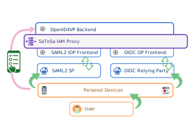

# eudi-wallet-it-python


[](https://github.com/italia/eudi-wallet-it-python/issues)
[](https://slack.developers.italia.it/)
[](https://developersitalia.slack.com/archives/C7E85ED1N/)

The EUDI Wallet Python toolchain is a suite of Python libraries designed to
make it easy the implementation of an EUDI Wallet Relying Party according 
to the [Italian Wallet implementation profile](https://italia.github.io/eid-wallet-it-docs/versione-corrente/en/).

The toolchain contains the following components:

| Name | Description |
| :--- | --- |
| __jwk__ | JSON Web Key (JWK) according to [RFC7517](https://datatracker.ietf.org/doc/html/rfc7517). | 
| __jwt__ | Signed and encrypted JSON Web Token (JWT) according to [RFC7519](https://datatracker.ietf.org/doc/html/rfc7519), [RFC7515](https://datatracker.ietf.org/doc/html/rfc7515) and [RFC7516](https://datatracker.ietf.org/doc/html/rfc7516) | 
| __tools.qrcode__ | QRCodes creation | 
| __oauth2.dpop__ | Tools for issuing and parsing DPoP artifacts, according to [OAuth 2.0 Demonstrating Proof-of-Possession at the Application Layer (DPoP)](https://datatracker.ietf.org/doc/html/draft-ietf-oauth-dpop) |
| __federation__ | Trust evaluation mechanisms, according to [OpenID Federation 1.0](https://openid.net/specs/openid-connect-federation-1_0.html) |
| __x509__ | Trust evaluation mechanism using X.509 PKI, according to [RFC5280](https://datatracker.ietf.org/doc/html/rfc5280) |
| __trust__ | trust handlers bringing multiple evaluation mechanisms |
| __satosa.backend__ | SATOSA Relying Party backend, according to [OpenID for Verifiable Presentations](https://openid.bitbucket.io/connect/openid-4-verifiable-presentations-1_0.html) |
| __openid4vp__ | Classes and schemas related to [OpenID for Verifiable Presentations](https://openid.bitbucket.io/connect/openid-4-verifiable-presentations-1_0.html) |
| __sd_jwt__ | Issuance and verification of SD-JWT(-VC) according to [Selective Disclosure for JWTs (SD-JWT)](https://datatracker.ietf.org/doc/draft-ietf-oauth-selective-disclosure-jwt/) |
| __status_list__ | Credential revocation check mechanisms according to [Token Status List](https://datatracker.ietf.org/doc/draft-ietf-oauth-status-list/) |


## Setup

Install enviroment and dependencies
````
sudo apt install python3-dev python3-pip git
sudo python3 -m pip install --upgrade pip
sudo python3 -m pip install virtualenv
````

Activate the environment. It's optional and up to you if you want to install 
in a separate env or system wide
````
virtualenv -p python3 env
source env/bin/activate
````

Install using pip:

`pip install pyeudiw` or `pip install pyeudiw[satosa]` for the satosa backend.

Install using github:

`pip install git+https://github.com/italia/eudi-wallet-it-python`

Optionally for generate the documentation you need to install the following packages:
`pip install sphinx sphinx_rtd_theme`


## Documentation

The API documentation is available in the githubpages, [here](https://italia.github.io/eudi-wallet-it-python/).

In the [docs/](docs) folder there are some common example for some specific tasks.


### Build the Documentation
For generate the documentaation enter in the terminal the following commands. 
The last argument is the exclude path, unit tests are then excluded from the API documentation.

````
cd docs
sphinx-apidoc -o ./source ../pyeudiw ../pyeudiw/tests
make html
````


## Example project

The example project is a docker-compose that runs a demo composed by the following component:

- Wordpress with SAML2 support and Bootstrap Italia template preregistered to the IAM Proxy.
- [Satosa-Saml2Spid](https://github.com/italia/Satosa-Saml2Spid) IAM Proxy with a preconfigured OpenID4VP backend.

Please read [this README](example/README.Wordpress.md) to get a fully working Wordpress setup with SAML2 support.


## SatoSa configuration

[SaToSa](https://github.com/IdentityPython/SATOSA) is a general purpose IAM 
proxy solution that allows interoperability between different entities that implements different
authentication protocols such as SAML2, OpenID Connect and OAuth2. This project offers a SaToSa
backend to enable the OpenID4VP protocol. 

There is a SaToSa distribution, created by the Developers Italia community, pre-configured to facilitate integration with the Italian National Digital Identity Systems,
it is [Satosa-Saml2Spid](https://github.com/italia/Satosa-Saml2Spid).



Please read this [README](README.SATOSA.md) any details about how to configure SaToSa with the OpenID4VP Relying Party backend.

## Executing Tests Using Preexisting MongoDb Instances

Use the env variable PYEUDIW_MONGO_TEST_AUTH_INLINE

````
PYEUDIW_MONGO_TEST_AUTH_INLINE=satosa:thatpassword@ pytest
````

## Contribute

Your contribution is welcome, no question is useless and no answer is obvious, we need you.


### Contribute as end user

Please open an issue if you've found a bug or if you want to ask some features.


### Contribute as developer

Please open your Pull Requests on the __dev__ branch. 
Please consider the following branches:

 - __main__: where we merge the code before tag a new stable release.
 - __dev__: where we push our code during development.
 - __other-custom-name__: where a new feature/contribution/bugfix will be handled, revisioned and then merged to dev branch.

### Executing Unit Tests

Once you have activate the virtualenv, further dependencies must be installed as show below.

````
pip install -r requirements-dev.txt

````

Therefore the unit tests can be executed as show below.

````
pytest pyeudiw -x
````

If you test pyeudiw on a development machine where also iam-proxy-italia is running with its mongodb and the same collection names,
you can run the test by passing the mon user and password in this way

````
PYEUDIW_MONGO_TEST_AUTH_INLINE="satosa:thatpassword@" pytest pyeudiw -x
````

### Executing integration tests

iam-proxy-italia project must be configured and in execution.

Integrations tests checks bot hthe cross device flow and the same device flow.

The cross device flow requires `playwrite` to be installed.

````
cd examples/satosa/integration_tests

playwrite install

PYEUDIW_MONGO_TEST_AUTH_INLINE="satosa:thatpassword@" pytest pyeudiw -x
````

## External Resources and Tools

- [EUDIW Ref Implementation VCI](https://issuer.eudiw.dev/)
- [EUDIW Ref Implementation RP](https://verifier.eudiw.dev/home)

## Authors

- Giuseppe De Marco

## Acknowledgments

- Thomas Chiozzi
- Pasquale De Rose
- Elisa Nicolussi Paolaz
- Salvatore Laiso
- Alessio Murru
- Nicola Saitto
- Sara Longobardi
