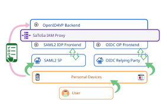

# eudi-wallet-it-python

[](https://github.com/italia/eudi-wallet-it-python/actions/workflows/python-app.yml)


[](https://github.com/italia/eudi-wallet-it-python/issues)
[](https://slack.developers.italia.it/)

The eID Wallet Python toolchain is a suite of Python libraries designed to
make it easy the implementation of an EUDI Wallet Relying Party according 
to the [Italian Wallet implementation profile](https://italia.github.io/eid-wallet-it-docs/versione-corrente/en/).

The toolchain contains the following components:

| Name                | Description                                                                                                                                                                                                                            | Documentation |
|:--------------------|----------------------------------------------------------------------------------------------------------------------------------------------------------------------------------------------------------------------------------------|:--------------|
| __jwk__             | JSON Web Key (JWK) according to [RFC7517](https://datatracker.ietf.org/doc/html/rfc7517).                                                                                                                                              | [JWK.md](docs/JWK.md) |
| __jwt__             | Signed and encrypted JSON Web Token (JWT) according to [RFC7519](https://datatracker.ietf.org/doc/html/rfc7519), [RFC7515](https://datatracker.ietf.org/doc/html/rfc7515) and [RFC7516](https://datatracker.ietf.org/doc/html/rfc7516) | [JWT.md](docs/JWT.md) |
| __tools.qrcode__    | QR codes for cross-device flows (OpenID4VP, OpenID4VCI)                                                                                                                                                                                | [TOOLS-QRCODE.md](docs/TOOLS-QRCODE.md) |
| __oauth2.dpop__     | Tools for issuing and parsing DPoP artifacts, according to [OAuth 2.0 DPoP](https://datatracker.ietf.org/doc/html/draft-ietf-oauth-dpop)                                                                                              | [OAUTH2-DPOP.md](docs/OAUTH2-DPOP.md) |
| __federation__      | Trust evaluation mechanisms, according to [OpenID Federation 1.0](https://openid.net/specs/openid-connect-federation-1_0.html)                                                                                                         | [FEDERATION.md](docs/FEDERATION.md) |
| __x509__            | Trust evaluation mechanism using X.509 PKI, according to [RFC5280](https://datatracker.ietf.org/doc/html/rfc5280)                                                                                                                      | [X509.md](docs/X509.md) |
| __trust__           | Trust handlers bringing multiple evaluation mechanisms                                                                                                                                                                                 | [TRUST.md](docs/TRUST.md) |
| __satosa.backend__  | SATOSA Relying Party backend, according to [OpenID for Verifiable Presentations](https://openid.bitbucket.io/connect/openid-4-verifiable-presentations-1_0.html)                                                                       | [OPENID4VP-SATOSA-BACKEND.md](docs/OPENID4VP-SATOSA-BACKEND.md) |
| __satosa.frontend__ | SATOSA Issuer frontend, according to [OpenID for Verifiable Credential Issuance](https://openid.github.io/OpenID4VCI/openid-4-verifiable-credential-issuance-wg-draft.html)                                                            | [OPENID4VCI-SATOSA-FRONTEND.md](docs/OPENID4VCI-SATOSA-FRONTEND.md) |
| __openid4vp__       | Classes and schemas related to [OpenID for Verifiable Presentations](https://openid.bitbucket.io/connect/openid-4-verifiable-presentations-1_0.html)                                                                                   | [OPENID4VP.md](docs/OPENID4VP.md) |
| __openid4vci__      | Classes and schemas related to [OpenID for Verifiable Credential Issuance](https://openid.github.io/OpenID4VCI/openid-4-verifiable-credential-issuance-wg-draft.html)                                                                  | [OPENID4VCI.md](docs/OPENID4VCI.md) |
| __sd_jwt__          | Issuance and verification of SD-JWT(-VC) according to [Selective Disclosure for JWTs (SD-JWT)](https://datatracker.ietf.org/doc/draft-ietf-oauth-selective-disclosure-jwt/)                                                          | [SD-JWT.md](docs/SD-JWT.md) |
| __status_list__     | Credential revocation check mechanisms according to [Token Status List](https://datatracker.ietf.org/doc/draft-ietf-oauth-status-list/)                                                                                                | [STATUS_LIST.md](docs/STATUS_LIST.md) |


## Setup

Install enviroment and dependencies
````
sudo apt install python3-dev python3-pip git
sudo python3 -m pip install --upgrade pip
sudo python3 -m pip install virtualenv
````

Activate the environment. It's optional and up to you if you want to install 
in a separate env or system wide
````
virtualenv -p python3 env
source env/bin/activate
````

Install using pip:

`pip install pyeudiw` or `pip install pyeudiw[satosa]` for the satosa backend.

Install using github:

`pip install git+https://github.com/italia/eudi-wallet-it-python`

Optionally for generate the documentation you need to install the following packages:
`pip install sphinx sphinx_rtd_theme`


## Documentation

The API documentation is available in the githubpages, [here](https://italia.github.io/eudi-wallet-it-python/).

In the [docs/](docs) folder you will find:

- **Component-specific guides** (usage, examples):
  - [JWK](docs/JWK.md)
  - [JWT](docs/JWT.md)
  - [SD-JWT](docs/SD-JWT.md)
  - [OAUTH2 DPoP](docs/OAUTH2-DPOP.md)
  - [Federation](docs/FEDERATION.md)
  - [X509](docs/X509.md)
  - [Trust](docs/TRUST.md)
  - [Status List](docs/STATUS_LIST.md)
  - [tools.qrcode](docs/TOOLS-QRCODE.md)
  - [OpenID4VP](docs/OPENID4VP.md)
  - [OpenID4VCI](docs/OPENID4VCI.md)
- **SATOSA setup**:
  - [OpenID4VP Backend](docs/OPENID4VP-SATOSA-BACKEND.md)
  - [OpenID4VCI Frontend](docs/OPENID4VCI-SATOSA-FRONTEND.md)


### Build the Documentation
For generate the documentation enter in the terminal the following commands. 
The last argument is the exclude path, unit tests are then excluded from the API documentation.

````
cd docs
sphinx-apidoc -o ./source ../pyeudiw ../pyeudiw/tests
make html
````


## Example project

The example project is a docker-compose that runs a demo composed by the following component:

- Wordpress with SAML2 support and Bootstrap Italia template preregistered to the IAM Proxy.
- [Satosa-Saml2Spid](https://github.com/italia/Satosa-Saml2Spid) IAM Proxy with a preconfigured OpenID4VP backend.

Please read [this README](example/README.Wordpress.md) to get a fully working Wordpress setup with SAML2 support.


## SatoSa configuration

[SaToSa](https://github.com/IdentityPython/SATOSA) is a general purpose IAM 
proxy solution that allows interoperability between different entities that implements different
authentication protocols such as SAML2, OpenID Connect and OAuth2. This project offers: 
- a SaToSa backend to enable the OpenID4VP protocol; 
- a SaToSa frontend to enable the OpenID4VCI protocol. 

There is a SaToSa distribution, created by the Developers Italia community, pre-configured to facilitate integration with the Italian National Digital Identity Systems,
it is [Satosa-Saml2Spid](https://github.com/italia/Satosa-Saml2Spid).



Please refer to the dedicate README files for details on how to configure SaToSa with the respective components:
- [OpenID4VP Relying Party backend](docs/OPENID4VP-SATOSA-BACKEND.md);
- [OpenID4VCI Issuer fronted](docs/OPENID4VCI-SATOSA-FRONTEND.md).

### Protocol Support Recap

Compliance checklist against the [Italian Wallet implementation profile](https://italia.github.io/eid-wallet-it-docs/versione-corrente/en/) and related OpenID4VCI/OpenID4VP specifications.

#### OpenID4VCI (Credential Issuer Frontend)

🟢 Supported · 🟠 Partial · 🔴 Not supported

| Feature | Status |
|---------|--------|
| Pushed Authorization Requests (PAR) | 🟢 |
| PAR: reject `request_uri` in request body (RFC 9126) | 🟢 |
| OAuth 2.0 Attestation-Based Client Authentication | 🟢 |
| PKCE | 🟢 |
| Authorization Code Flow | 🟢 |
| DPoP at Token endpoint | 🟢 |
| Immediate Issuance | 🟢 |
| JWT Proof of Possession (`openid4vci-proof+jwt`) | 🟢 |
| Nonce endpoint (`c_nonce`) | 🟢 |
| Credential Offer (by value and QR code) | 🟢 |
| Notification endpoint | 🟢 |
| SD-JWT VC credential format | 🟢 |
| mso_mdoc credential format | 🟢 |
| Refresh Token (DPoP-bound) | 🟢 |
| Batch Credential Issuance | 🔴 |
| Deferred Issuance Flow | 🔴 |

#### OpenID4VP (Relying Party Backend)

🟢 Supported · 🟠 Partial · 🔴 Not supported

| Feature | Status |
|---------|--------|
| DCQL (Duckle) query language | 🟢 |
| Same Device flow | 🟢 |
| Cross Device flow (QR code) | 🟢 |
| Request Object by reference (`request_uri`) | 🟢 |
| Request URI method GET | 🟢 |
| Request URI method POST (wallet metadata) | 🟢 |
| `wallet_metadata` and `wallet_nonce` | 🟢 |
| Response mode `direct_post.jwt` (encrypted) | 🟢 |
| Response mode `direct_post` | 🟢 |
| `vp_token` keyed by credential id | 🟢 |
| `dc+sd-jwt` format | 🟢 |
| `mso_mdoc` format | 🟢 |
| Status endpoint (session polling) | 🟢 |
| Trust evaluation (X.509 PKI, OpenID Federation) | 🟢 |
| Credential revocation (status list) | 🟢 |
| Custom URL schemes (`haip`, configurable) | 🟢 |
| `transaction_data` / `transaction_data_hashes` | 🔴 |

## Executing Tests Using Preexisting MongoDb Instances

Use the env variable `PYEUDIW_MONGO_TEST_AUTH_INLINE` so tests connect with credentials.
CI uses `PYEUDIW_MONGO_TEST_AUTH_INLINE=""` (MongoDB without auth). For local MongoDB with auth,
set it in `.env` (loaded by `./run_tests.sh`) or export it:

````
PYEUDIW_MONGO_TEST_AUTH_INLINE=satosa:thatpassword@ pytest pyeudiw -x
# or: echo 'PYEUDIW_MONGO_TEST_AUTH_INLINE=satosa:thatpassword@' >> .env && ./run_tests.sh
````

## Contribute

Your contribution is welcome, no question is useless and no answer is obvious, we need you.


### Contribute as end user

Please open an issue if you've found a bug or if you want to ask some features.


### Contribute as developer

Please open your Pull Requests on the __dev__ branch. 
Please consider the following branches:

 - __main__: where we merge the code before tag a new stable release.
 - __dev__: where we push our code during development.
 - __other-custom-name__: where a new feature/contribution/bugfix will be handled, revisioned and then merged to dev branch.

### Executing Unit Tests

Once you have activate the virtualenv, further dependencies must be installed as show below.

````
pip install -r requirements-dev.txt

````

Therefore the unit tests can be executed as show below.

````
pytest pyeudiw -x
````

If you test pyeudiw on a development machine where also iam-proxy-italia is running with its mongodb and the same collection names,
you can run the test by passing the mon user and password in this way

````
PYEUDIW_MONGO_TEST_AUTH_INLINE="satosa:thatpassword@" pytest pyeudiw -x
````

### Executing integration tests

iam-proxy-italia project must be configured and in execution.

Integrations tests checks bot hthe cross device flow and the same device flow.

The cross device flow requires `playwrite` to be installed.

````
cd examples/satosa/integration_tests

playwrite install

PYEUDIW_MONGO_TEST_AUTH_INLINE="satosa:thatpassword@" pytest pyeudiw -x
````

## External Resources and Tools

- [EUDIW Ref Implementation VCI](https://issuer.eudiw.dev/)
- [EUDIW Ref Implementation RP](https://verifier.eudiw.dev/home)

## Authors

- Giuseppe De Marco

## Acknowledgments

- Manuel Pacella
- Manuel Ciofo
- Thomas Chiozzi
- Pasquale De Rose
- Elisa Nicolussi Paolaz
- Salvatore Laiso
- Alessio Murru
- Nicola Saitto
- Sara Longobardi
